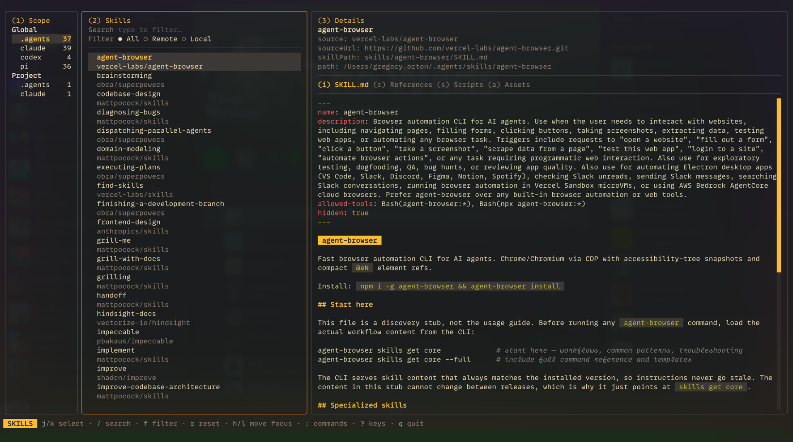

# Trainer



Trainer is a terminal app for browsing, inspecting, and managing agent skills
installed on your machine. It scans every known global location for agent skills
(`.agents` + supported harnesses) as well as known project-local locations
(`.agents` + supported harnesses).

Adding, updating, and deleting skills is supported via the industry-standard
[Vercel skills script](https://github.com/vercel-labs/skills) or file-system
access for locally installed skills.

## What it detects

Trainer scans the shared `.agents` skill store and the per-harness stores it
knows about. The harnesses and locations it currently detects:

| Harness | Global location | Project location |
| --- | --- | --- |
| `.agents` (shared store) | `~/.agents/skills` | `./.agents/skills` |
| claude | `~/.claude/skills` | `./.claude/skills` |
| codex | `~/.codex/skills` | (shares `.agents`) |
| opencode | `~/.config/opencode/skills` | (shares `.agents`) |
| pi | `~/.pi/agent/skills` | `./.pi/skills` |
| cursor | `~/.cursor/skills` | (shares `.agents`) |

Empty or absent locations are skipped. Support for the full set of agents that
`npx skills` handles is the first item on the roadmap.

## Install

**Homebrew (macOS and Linux):**

```sh
brew install makesometh-ing/tap/trainer
```

**Arch Linux (AUR):** the package is `trainer-bin`. With
[Shelly](https://www.seafoam-labs.org/shelly-alpm/):

```sh
shelly aur install trainer-bin   # install
shelly upgrade-all               # update (all sources, incl. AUR)
```

Any other AUR helper works too (e.g. `yay -S trainer-bin`), or build it by hand
with `git clone https://aur.archlinux.org/trainer-bin.git && cd trainer-bin && makepkg -si`.

**Debian / Ubuntu:** download the `.deb` for your architecture from the
[latest release](https://github.com/makesometh-ing/trainer/releases/latest) and
install it:

```sh
sudo dpkg -i trainer_*_amd64.deb   # or _arm64.deb
```

**Any other Linux, or manual install:** download the `.tar.gz` for your OS and
architecture from the releases page, extract it, and move `trainer` onto your
`PATH`:

```sh
tar xzf trainer_*_Linux_amd64.tar.gz
sudo mv trainer /usr/local/bin/
```

Check the install:

```sh
trainer --version
```

## Quick start

Run `trainer` in any directory. It scans your global skill stores and, if the
current directory is a project with its own skills, that project too. Pick a
scope on the left, a skill in the middle, and read its detail on the right.

Add, delete, and update act on the scope you have selected: a global scope
targets your global skills, a project scope targets that project. Every action
rescans afterwards so the list stays true to disk.

## Keys

Press `?` at any time for the in-app list. The defaults:

**Global**

| Key | Action |
| --- | --- |
| `1` / `2` / `3` | focus Scope / Skills / Details |
| `h` / `l` | move focus left / right |
| `:` | command palette |
| `?` | toggle help |
| `q` | quit |

**Skills pane**

| Key | Action |
| --- | --- |
| `j` / `k` | move selection |
| `/` | search |
| `f` | focus the origin filter (All / Remote / Local) |
| `r` | reset search and filter |
| `h` / `l` | move filter option (when the filter is focused) |
| `space` | apply filter option (when the filter is focused) |
| `c` | clear filter (when the filter is focused) |

**Details pane**

| Key | Action |
| --- | --- |
| `i` / `r` / `s` / `a` | switch tab: SKILL.md / References / Scripts / Assets |
| `tab` | toggle between file list and content |
| `j` / `k` | move file, or scroll content |
| `ctrl+d` / `ctrl+u` | half-page scroll (from any pane) |
| `g` / `G` | top / bottom of content |

**Command palette** (open with `:`, then the letter)

| Key | Action |
| --- | --- |
| `:a` | add a skill to the selected scope |
| `:d` | delete the selected skill |
| `:u` | update all skills in the selected scope |

## Contributing

Contributions are welcome. See [CONTRIBUTING.md](CONTRIBUTING.md) for how to
build, run the tests, and send a change.

## Roadmap

1. Support the same set of agents that `npx skills` supports.
2. Custom keybinding config.
3. Manual skill creator and editor.
4. AI skill creator.

## License

MIT. See [LICENSE](LICENSE).
